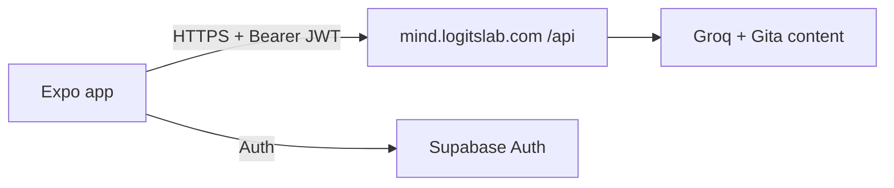

# MindKshetra mobile architecture

Expo client for MindKshetra. The **system-wide** architecture (API, chat, deploy) lives in the web repo:

→ **[MindKshetra ARCHITECTURE.md](https://github.com/LogitsLab/MindKshetra/blob/main/ARCHITECTURE.md)**

This document covers how the **mobile app** is structured and how it consumes that backend.

---

## Role in the system



- Madhav streams from `POST /api/chat` (SSE), verse-grounded only
- Same Supabase project as web for identity

---

## App structure

```
app/                      # Expo Router
  _layout.tsx             # Providers, fonts, Madhav FAB
  (tabs)/                 # Home, Explore, Mood, Practise
  madhav.tsx              # Modal chat
  account/                # Profile, auth, reflections
  sloka/[id].tsx          # Verse detail
  …

src/
  api/client.ts           # apiFetch + streamChat (expo/fetch)
  api/endpoints.ts        # Typed API wrappers
  auth/                   # Supabase client + redirects
  context/                # Auth, Madhav, Language, Theme, TextScale, Onboarding
  i18n/                   # en / hi
  theme/                  # Tokens aligned with web DESIGN.md
  storage/local.ts        # AsyncStorage
```

**Navigation:** tabs = Home · Explore · Mood · Practise. Madhav = FAB → modal (not a tab).

**Provider order:** Theme → TextScale → Language → Onboarding → Auth → Madhav.

---

## API client

| Piece | Behavior |
|-------|----------|
| Base URL | `EXPO_PUBLIC_API_URL` (prod default `https://mind.logitslab.com`) |
| Auth | `Authorization: Bearer <supabase access_token>` when session exists |
| JSON APIs | `apiFetch` in `src/api/client.ts` |
| Madhav | `streamChat` — SSE over `expo/fetch` `ReadableStream` |

Chat may send optional `slokaId` when the thread started from a verse. It does not send birth data or member ids.

---

## Auth & storage

| Concern | Implementation |
|---------|----------------|
| Session | Supabase JS + AsyncStorage |
| Methods | Anonymous, Google, email OTP, Sign in with Apple |
| Deep link | `mindkshetra://auth/callback` |
| Guest merge | On upgrade: merge chat session + guest progress via API |
| Local prefs | Theme, language, text scale, onboarding flag, chat session id |

---

## Release pipeline

1. Marketing version in `app.json` (`expo.version`)  
2. Optional notes in `store/release-notes/<version>.md`  
3. On version change to `main` (or manual Action): EAS `production` build  
4. Auto-submit: TestFlight + Play **internal** (see `eas.json`)  

Native build numbers auto-increment on EAS (`appVersionSource: remote`).  
Supabase public env for builds: Expo dashboard / EAS env (not committed in `eas.json`).

---

## Env

```bash
EXPO_PUBLIC_API_URL=
EXPO_PUBLIC_SUPABASE_URL=
EXPO_PUBLIC_SUPABASE_ANON_KEY=
```

See [`.env.example`](.env.example). Never commit `.env` or `google-service-account.json`.

---

## Related

- [README.md](README.md) — quick start  
- [CONTRIBUTING.md](CONTRIBUTING.md) — issues & PRs  
- [store/listing.json](store/listing.json) — store copy  

Ideas or bugs? [Open an issue](https://github.com/LogitsLab/MindKshetra-app/issues) with details.
